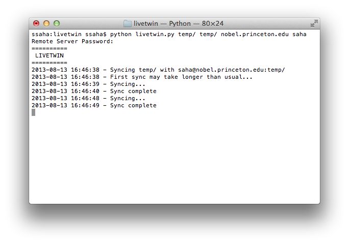

LiveTwin
========

LiveTwin is a cross-platform "hacker's dropbox". It is a small python script that monitors the local filesystem for changes and syncs contents with a remote folder via rsync.

Use Case
---
You have files in a local directory. You have files in a remote directory. You want the remote directory to look exactly like the local directory, every second.

For hackers, LiveTwin is faster than Dropbox to set up and sync because it doesn't require a server in the middle.

How it Works
---
The script is simple. It uses [watchdog](https://pypi.python.org/pypi/watchdog) to monitor the filesystem and [rsync](http://rsync.samba.org/) to synchronize files.

Installation
------------
Install dependencies:

	sudo pip install -r requirements.txt

Usage
-----
Run LiveTwin from Terminal:

	python livetwin.py [local dir] [remote dir] [server] [user]

LiveTwin will then ask you for your password. Change the local directory contents to watch files instantly sync!
